# TOC Project 2022
Develop a Line bot based on a finite state machine with OpenAI and Google Cloud Vision API
> LINE PC version not supported because of rich menu

## Setup
#### Secret Data
You should generate a `./src/.env` file to set Environment Variables refer to `./src/.env.sample`.

You should generate a  `./key.json` file of Google Cloud Keys.

#### Rich Menu
You should generate a rich menu by [req_rich_menu.ipynb](./src/req_rich_menu.ipynb).

#### Run
```sh
python src/app.py
```

## Finite State Machine
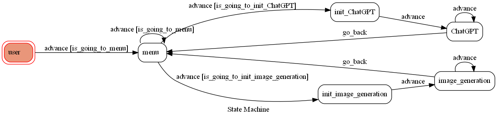

## Features
### Rich Menu
* 點選 rich menu: 使用postback直接將data傳到後端
* Rich menu不支援電腦版

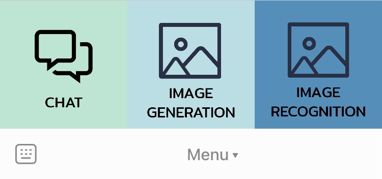

### Chat
* By OpenAI GPT3 model
* Quick reply: 早安

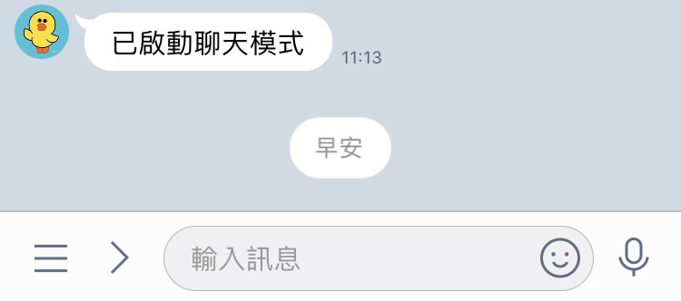 

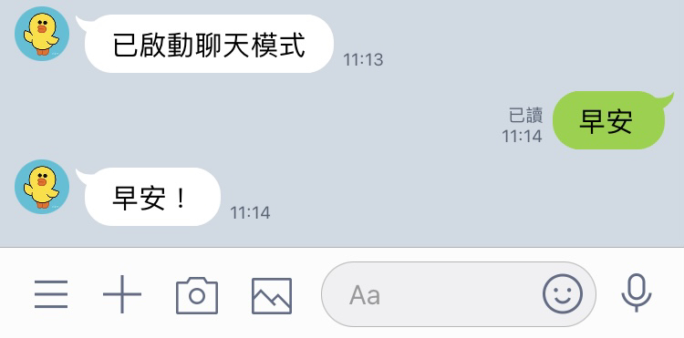

### Image Generation
* By OpenAI Image generation
* Quick reply: 有綠色眼睛的黑貓

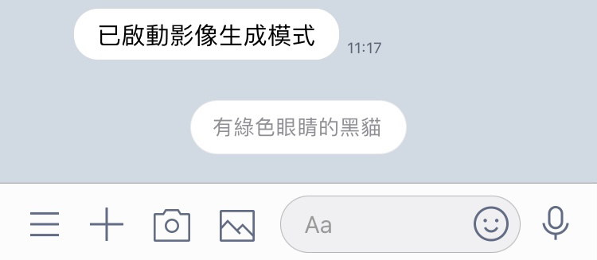
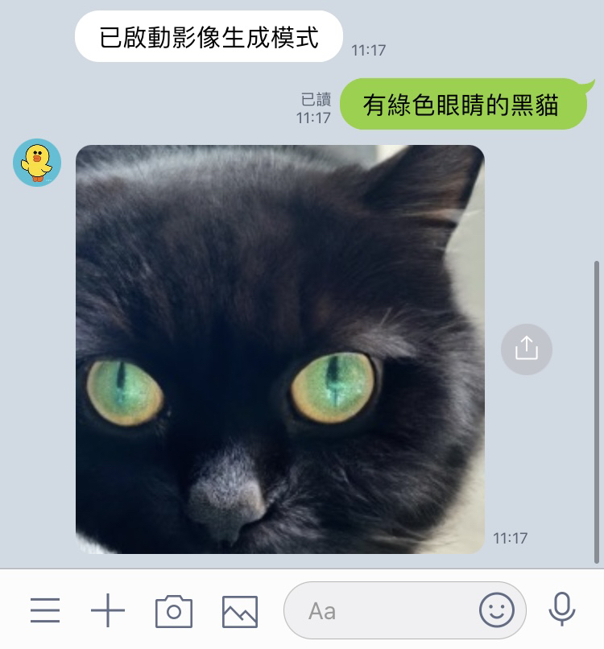

### Image Reconition
* By Google Cloud Vision API

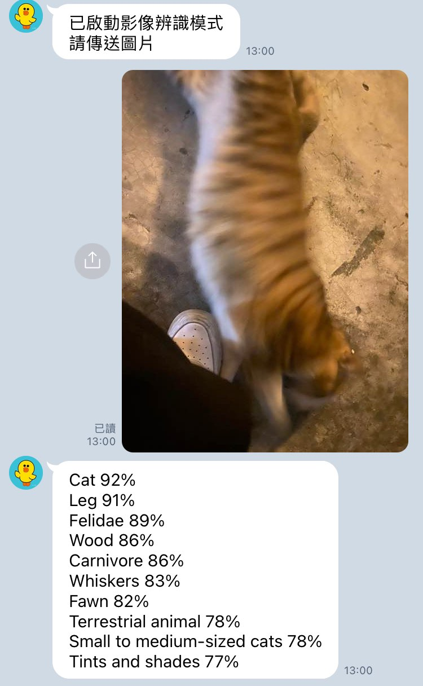

### Sticker Parrot
* user傳送[line官方sticker message](https://developers.line.biz/en/docs/messaging-api/sticker-list/): 回傳相同貼圖
* user傳送**非**line官方sticker message: invalid command

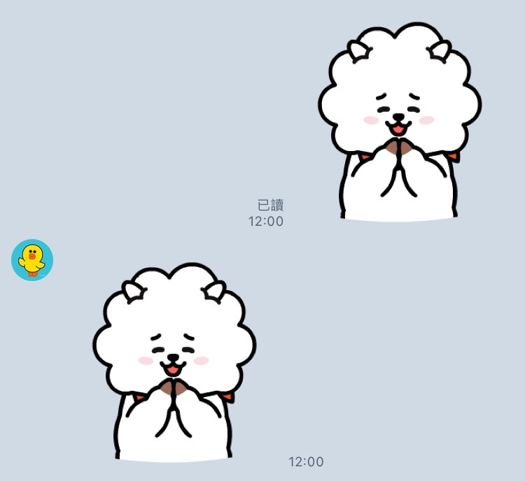

### Error Handle
#### Invalid Command

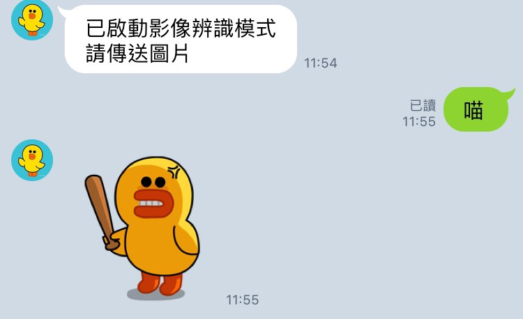

#### Reject by OpenAI
> OpenAI拒絕生成敏感圖片

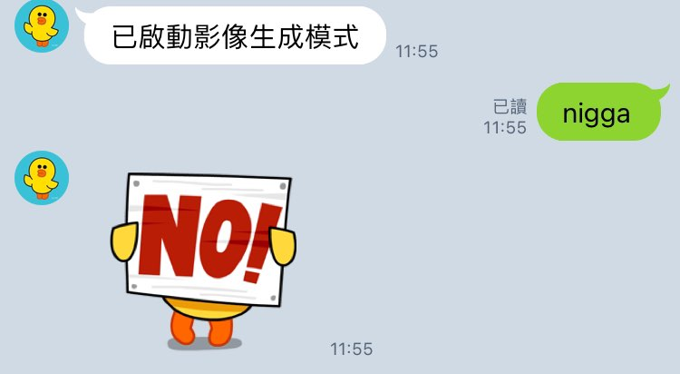

#### Cannot recognize image

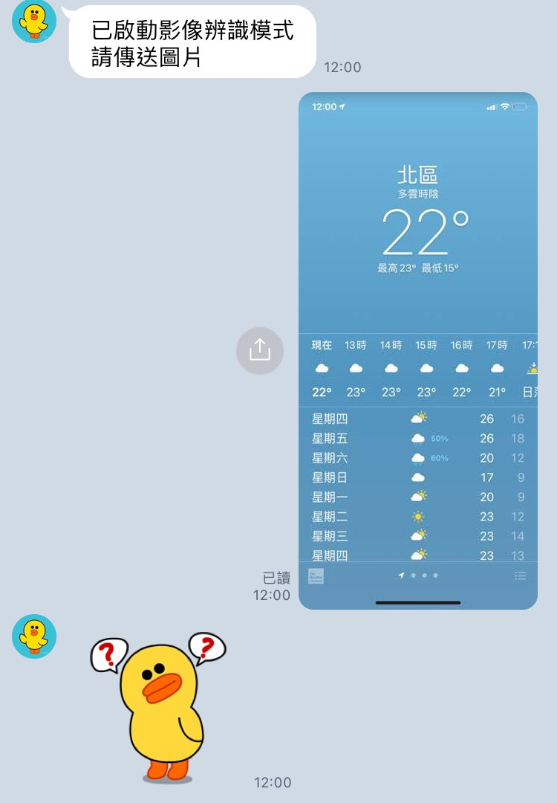

## Bonus (5-10%)
a. Deploy :
• AWS - Amazon Web Service.
• Heroku - PaaS (Platform as a service).
• Microsoft Azure.
• GCP - Google cloud platform.
b. Extra functionality or technics :
• Line API.
• image/sound/video.
• Web crawling.
• Machine learning.
• Blockchain.
• Others.

## Reference
[Line line-bot-sdk-python](https://github.com/line/line-bot-sdk-python/tree/master/examples/flask-echo)

[OpenAI](https://openai.com/)

[Google Cloud Vision API](https://cloud.google.com/vision)
