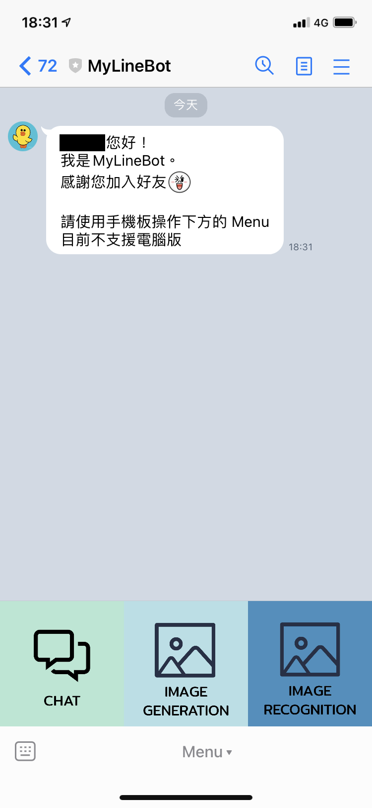
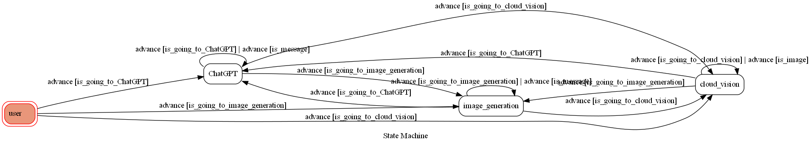

# TOC Project 2022
Develop a Line bot based on a finite state machine with OpenAI and Google Cloud Vision API

Does not support LINE PC version because of rich menu
## Bot information
* Bot basic ID: @723zdtoa
* QR code

    

* Greeting messages

    


## Setup
#### Secret Data
You should generate a `./src/.env` file to set Environment Variables refer to `./src/.env.sample`.

You should generate a  `./key.json` file of Google Cloud Keys.

#### Rich Menu
You should generate a rich menu by [req_rich_menu.ipynb](./src/req_rich_menu.ipynb).

#### Run
```sh
python src/app.py
```

## Finite State Machine


## Features
### Rich Menu
* 點選 rich menu: 使用postback直接將data傳到後端
* Rich menu不支援電腦版


### Chat
* By OpenAI GPT3 model
* Quick reply: 早安

 


### Image Generation
* By OpenAI Image generation
* Quick reply: 有綠色眼睛的黑貓


### Image Reconition
* By Google Cloud Vision API


### Sticker Parrot
* user傳送[line官方sticker message](https://developers.line.biz/en/docs/messaging-api/sticker-list/): 回傳相同貼圖
* user傳送**非**line官方sticker message: invalid command


### Error Handle
#### Invalid Command


#### Reject by OpenAI
> OpenAI拒絕生成敏感圖片


#### Cannot recognize image


## Bonus
* Deploy
    * GCP - Google cloud platform
        * server: [https://lynn.cf](https://lynn.cf)
* Extra functionality or technics
    * Line API
        * Postback Event
        * Sticker Message
        * Image Message
        * Rich Menu
        * Quick Reply
    * image
    * Machine learning
        * OpenAI
        * Google Cloud Vision API
## Reference
[Line line-bot-sdk-python](https://github.com/line/line-bot-sdk-python/tree/master/examples/flask-echo)

[OpenAI](https://openai.com/)

[Google Cloud Vision API](https://cloud.google.com/vision)