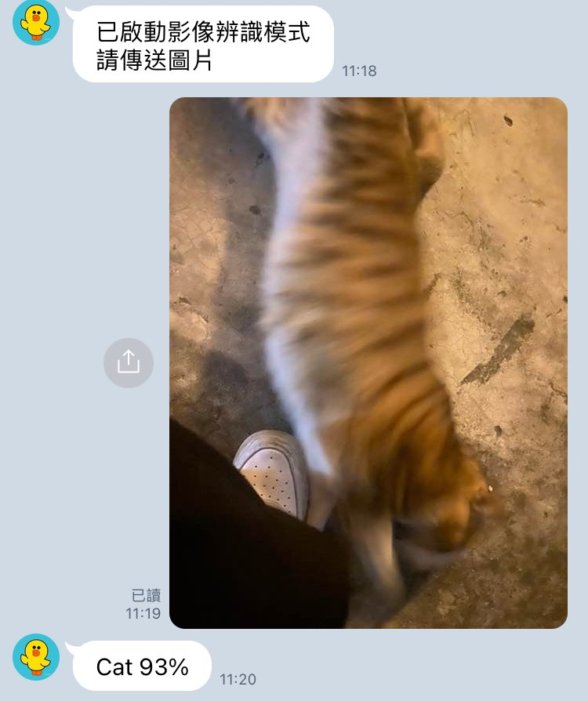

# TOC Project 2022
A Line bot based on a finite state machine with openAI and Google Cloud Vision API
> LINE PC version not supported because of rich menu

## Setup
#### Secret Data
You should add a `./src/.env` file to set Environment Variables refer to our `.env.sample`.

You should add a  `./key.json` file of Google Cloud Keys.

#### Run Locally
You can either setup https server or using `ngrok` as a proxy.

#### Run the sever
```sh
python src/app.py
```

## Finite State Machine


## Features
### rich menu
* 點選 rich menu: 使用postback直接將data傳到後端
* 使用 [rich_menu_copy.ipynb](./src/rich_menu_copy.ipynb) 生成


### chat
* by openAI GPT3 model
* quick reply: 早安

 


### image generation
* by openAI Image generation
* quick reply: 有綠色眼睛的黑貓


### image reconition
* by Google Cloud Vision API



### sticker parrot
* 若user傳送[line官方sticker message](https://developers.line.biz/en/docs/messaging-api/sticker-list/) -> 回傳相同貼圖
* 若user傳送**非**line官方sticker message -> invalid command


### error handle
#### invalid command


#### reject by openAI
> openAI拒絕生成敏感圖片


#### cannot recognize image


## Reference
[Line line-bot-sdk-python](https://github.com/line/line-bot-sdk-python/tree/master/examples/flask-echo)

[openAI](https://openai.com/)

[Google Cloud Vision API](https://cloud.google.com/vision)
